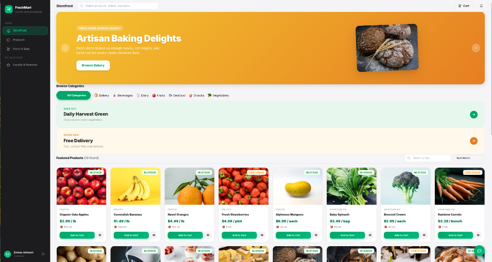
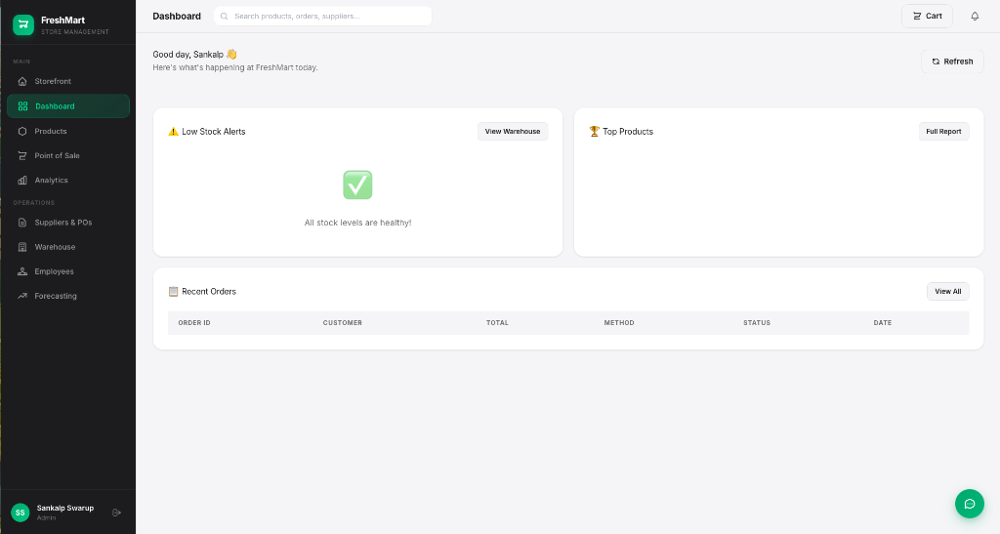
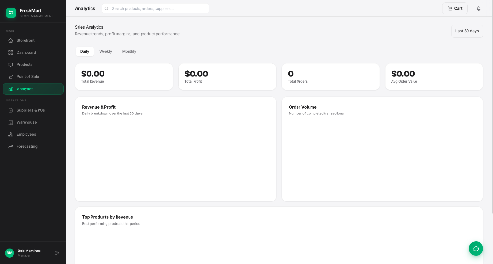
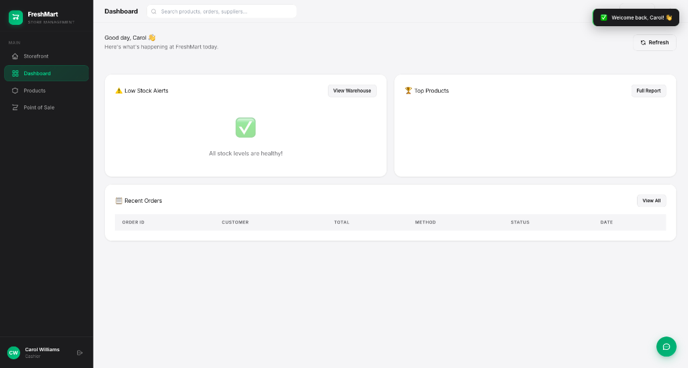

# 🥬 FreshMart Grocery Store Management System

> An enterprise-grade, highly optimized, and beautifully architected Grocery Store Management System featuring a high-end B2C storefront, a multi-role administrative dashboard, an interactive Point of Sale (POS), smart analytics, and demand forecasting.

[](https://fastapi.tiangolo.com)
[](https://alpinejs.dev)
[](https://tailwindcss.com)
[](https://www.sqlite.org)

---

## 🎨 Immersive Interface Showcase

FreshMart features a premium, Apple-inspired glassmorphic dashboard architecture with smooth interactive slides, responsive layouts, and rich hover states modeled after the high-end *Grocery Mania v2* storefront.

### 🛒 image 4: Customer Storefront View
Experience a stunning customer storefront featuring dynamic hero sliders, category scrolls, promotional deals, and real-time product catalogs—loaded purely from database records.

<p align="center">
  
</p>

---

### 👑 image 1: Admin Dashboard View
An immersive, role-protected dashboard for admins (such as Super-Admin `Sankalp Swarup`) featuring live financial analytics, low-stock warnings, upcoming product expiry reports, and active cashier shifts.

<p align="center">
  
</p>

---

### 📈 image 2: Manager Analytics View
Dedicated access panel for store managers with integrated high-fidelity charts detailing sales revenue trends, overall profits, daily order counts, and top performing products.

<p align="center">
  
</p>

---

### 💸 image 3: Cashier Dashboard View
A high-performance cashier operational dashboard supporting quick Point of Sale (POS) checkouts, real-time inventories status, low stock alarms, and customer cart registries.

<p align="center">
  
</p>

---

## 🚀 Core Features

### 1. **Dynamic B2C Storefront**
*   **Asynchronous Seeding Engine**: Loads storefront slides, promos, and footer descriptions purely from SQLite database records via `/api/storefront/config`.
*   **Pulsing CSS Skeleton Loaders**: Displays graceful placeholders during active API fetch delays, replacing them with dynamic payloads seamlessly.
*   **Responsive Slider Arrow Isolation**: Uses explicit padding stacks to fully isolate navigation arrow keys from titles, avoiding typography collisions on all screen sizes.

### 2. **Multi-Role Security Guard**
*   **Secure Seeding**: Auto-checks and seeds the operational super-administrator (`Sankalp Swarup`) on startup with a hashed password (native bcrypt, no plain text).
*   **Domain Validation**: Features a custom regex email validator supporting private `.local` domains (such as `sankalp.swarup@grocerymania.local`) securely.
*   **JWT Sessions**: Full role-based access control (Admin, Manager, Cashier, Customer) protected via token-signed REST dependencies.

### 3. **Smart Logistics & Inventory**
*   **Point of Sale (POS)**: Real-time price calculation from weight scale payloads and direct item lookups.
*   **Low Stock & Expiry Alerts**: Automatically triggers system alerts when inventories fall below critical thresholds or products are near their expiry dates.
*   **Loyalty points & Rewards**: Accumulates dynamic points and scales loyalty tiers (Bronze, Silver, Gold, Platinum).

---

## 💻 Tech Stack

*   **Backend Engine**: FastAPI (Asynchronous Python REST API), Uvicorn.
*   **Data Tier**: SQLite, SQLAlchemy ORM (WAL mode enabled for concurrent writes, foreign key cascade deletion).
*   **Security Stack**: Python-Jose (signature JWTs), Native Bcrypt.
*   **Frontend UI**: HTML5, Alpine.js (Reactive client-side routing), Tailwind CSS (Premium Glassmorphic styles).

---

## 🏃 Quick Start Guide

### Prerequisites
*   Python 3.10+
*   Git

### Installation & Launch
1.  **Clone the Repository**:
    ```bash
    git clone https://github.com/Sankalp28Roop/Grocery-Store-Management-System-.git
    cd Grocery-Store-Management-System-
    ```

2.  **Execute the Helper Startup Script**:
    The startup script handles virtual environment creation, pip dependencies installation, database tables creation, and uvicorn backend activation automatically:
    ```bash
    chmod +x start.sh
    ./start.sh
    ```

3.  **Explore the App**:
    Open your browser and navigate to:
    *   **Main Application**: `http://127.0.0.1:8000`
    *   **OpenAPI Swagger Docs**: `http://127.0.0.1:8000/docs`

### 🔑 Seeded Authentication Accounts
You can immediately sign in or use the quick demo shortcut buttons on the Login page:
*   **Super-Administrator**: `sankalp.swarup@grocerymania.local` / `admin123`
*   **Manager**: `manager@freshmart.com` / `manager123`
*   **Cashier**: `cashier@freshmart.com` / `cashier123`
*   **Customer**: `emma@example.com` / `customer123`

---

## 🏛️ Architecture & Separation of Concerns

```text
├── backend/
│   ├── routers/          # Modular API routers (auth, pos, warehouse, chatbot)
│   ├── auth.py           # Native bcrypt hashing & signed JWT token factory
│   ├── database.py       # Asynchronous seeding engine & session managers
│   ├── models.py         # SQLAlchemy relational database ORM schemas
│   ├── schemas.py        # Strict Pydantic v2 request/response types
│   └── main.py           # FastAPI lifecycle handlers & CORS middlewares
├── frontend/
│   ├── css/              # App stylesheets & storefront layout adapters
│   ├── js/               # Interactive Alpine.js controller frameworks
│   └── index.html        # Single-page dashboard viewport
└── start.sh              # Unified local environment launcher script
```

---

*FreshMart Grocery Store Management System — Developed by Sankalp Swarup in pair programming with Antigravity.*
